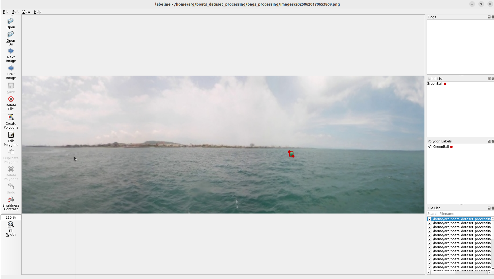
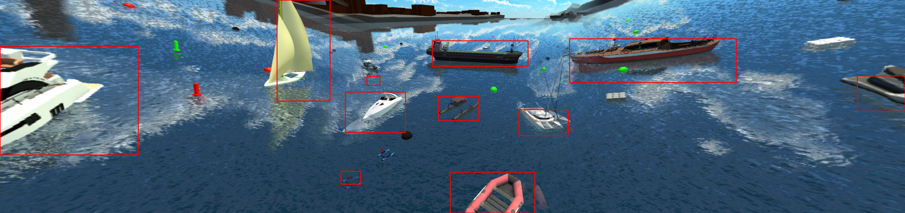

# Boats Dataset Processing
This repo is used for 
1. converting Labelme format to COCO format, and further to HugingFace dataset format.
2. converting Robotx2022-Unity-dataset format to COCO format, and further to HugingFace dataset format.

## 1. Real dataset processing Guide

[docs/real-dataset-processing.md](https://github.com/ARG-NCTU/boats_dataset_processing/blob/main/docs/real-dataset-processing.md)

## 2. Virtual dataset processing Guide

[docs/virtual-dataset-processing.md](https://github.com/ARG-NCTU/boats_dataset_processing/blob/main/docs/virtual-dataset-processing.md)

- Segmentation annotations image

- Source image with bbox annotations

