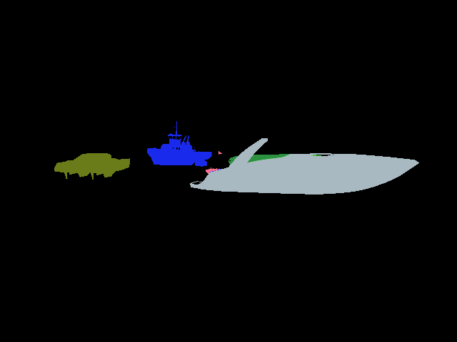
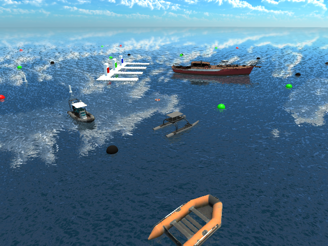
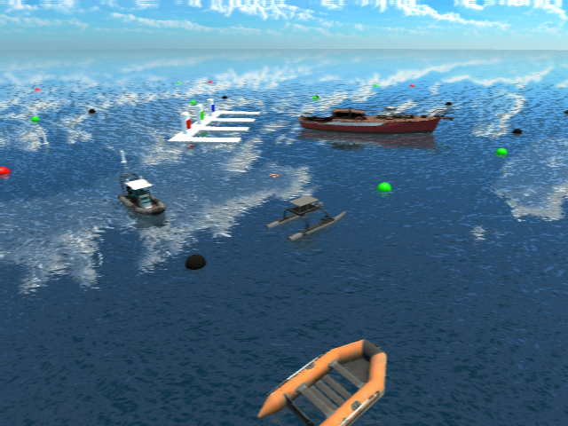
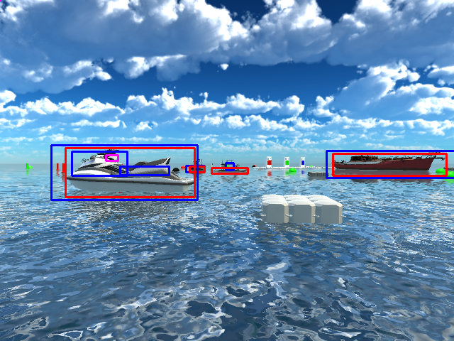

# Boats Dataset Processing
This repo is used for converting Robotx2022-Unity-dataset format to COCO format, and further to HugingFace dataset format.

## Usage
Clone this repo:
```bash
git clone git@github.com:ARG-NCTU/boats_dataset_processing.git
```

Enter this repo:
```bash
cd boats_dataset_processing
```

Run the oop docker:
```bash
source docker_run.sh
```

### 1. Robotx2022 Unity dataset Processing
Enter directory for unity dataset processing:
```bash
cd Boat_dataset_unity
```

#### 1.1. Robotx2022 Unity dataset Visualization
Print segmentation (You can modify the segementation image path)
```bash
python3 visualize_seg.py
```

Example result



#### 1.2. Gaussian Blur
Apply gaussian blur (You can modify the level of gaussian blur and images folders)
```bash
python3 gaussian_blur.py
```

Example results
- Source Image



- Blur Level 1 Image



- Blur Level 2 Image


#### 1.3. Convert Robotx2022 Unity dataset format to COCO format
Convert to COCO format (You can first modify the mask_ids.json and classes.txt then modify obscure rate which is default to 30%)
```bash
python3 merge_json_unity.py
```
Labels should save in json files.

Visualization of multiboat 
- Blue: bbox
- Red: seg->bbox
- Pink: obscure bbox



Copy rgb & thermal images
```bash
python3 copy_images.py
```

### 2. Merge real & virtual dataset
- Download the real dataset: [link](http://gofile.me/773h8/7KZ0g4cRG)
- If Skipping step1, download converted virtual dataset: [link](http://gofile.me/773h8/uDx6b4Ufp)

Merge real & converted virtual dataset
```bash
python3 merge_real_virtual.py
```

Get stats of annotations
```bash
python3 statistic_class.py
```

### 3. Convert COCO format to HuggingFace dataset format
Convert to HuggingFace dataset format:
```bash
python3 coco2hf.py
```
Enter directory of huggingface dataset:
```bash
cd Boat_dataset_hf
```

Some useful instructions for uploading hugginface dataset:
```bash
huggingface-cli login
huggingface-cli repo create Boat_dataset --type dataset

huggingface-cli upload ARG-NCTU/Boat_dataset_2024 Boat_dataset_2024.py --repo-type=dataset --commit-message="Update script to hub"
huggingface-cli upload ARG-NCTU/Boat_dataset_2024 README.md --repo-type=dataset --commit-message="Update README to hub"

huggingface-cli upload ARG-NCTU/Boat_dataset_2024 annotations/instances_train2024.jsonl data/instances_train2024.jsonl --repo-type=dataset --commit-message="Upload training labels to hub"
huggingface-cli upload ARG-NCTU/Boat_dataset_2024 annotations/instances_val2024.jsonl data/instances_val2024.jsonl --repo-type=dataset --commit-message="Upload val labels to hub"
huggingface-cli upload ARG-NCTU/Boat_dataset_2024 classes.txt data/classes.txt --repo-type=dataset --commit-message="Upload classes list to hub"
```
