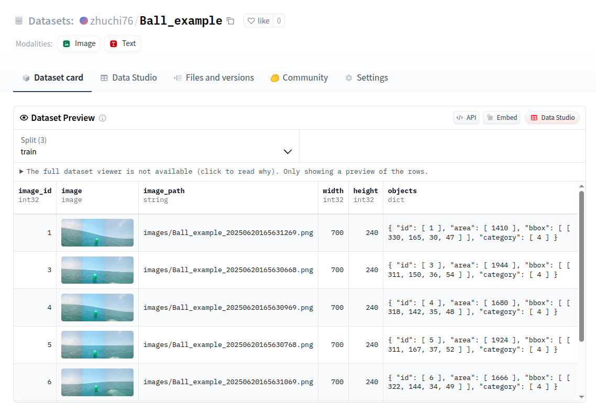

# Boats Dataset Processing

## Clone repo

```bash
cd ~/ && git clone git@github.com:ARG-NCTU/boats_dataset_processing.git
```

## Setting HuggingFace token

```bash
vim ~/.bashrc
```

Go to HuggingFace Web page: this [link](https://huggingface.co/settings/tokens) to add your own token

Then add this line (Replace with your token):
```bash
export HUGGINGFACE_TOKEN=hf_...xxxx
```

## Enter the repo

```bash
cd ~/boats_dataset_processing
```

## Enter Docker Environment

For first terminal to enter Docker environment:
```bash
source cpu_run.sh
```

For Second or more terminal to enter Docker environment:
```bash
source cpu_join.sh
```

## Usage

### Labelme

Use Labelme tools to label images


```bash
labelme
```

Visualize labelme annotations


```bash
cd ~/boats_dataset_processing/bags_processing
python3 visualize_bbox.py \
--root_dir ~/boats_dataset_processing/bags_processing/images
```

### Real Dataset processing Example

```bash
cd ~/boats_dataset_processing
```

Convert to COCO format
```bash
python3 labelme2coco.py \
--labelme_dir bags_processing/Ball_example \
--output_dir Ball_example \
--classes classes/TW_Marine_5cls_classes.txt
```

Visualize COCO format annotations


```bash
python3 visualize_coco.py \
--coco_json Ball_example/annotations/instances_train2024.json \
--image_dir Ball_example/images \
--output_dir Ball_example/Visualization
```

Convert to HuggingFace parquet format
```bash
python3 coco2parquet.py \
--input_dir Ball_example/annotations \
--image_dir Ball_example/images \
--output_dir Ball_example_hf/annotations
```

Visualize parquet format annotations
```bash
python3 visualize_parquet.py \
--parquet_folder Ball_example_hf/annotations
```

Add Ball_example/annotations/classes.txt file and edit this file like:
```bash
Buoy
GuardBoat
RedBall
YellowBall
GreenBall
```

Copy train / val images
```bash
python3 copy_train_val_test_images.py --dir Ball_example
```

Upload HuggingFace dataset



```bash
source upload_hf.sh zhuchi76/Ball_example zhuchi76/Ball_example_coco Ball_example Ball_example_hf
```

### !!! Test !!!

Please make "TW_Marine_5cls_example" and "TW_Marine_5cls_example_coco" huggingface dataset repo with your own huggingface account. 
Sample images are under "bags_processing/TW_Marine_5cls_example" folder.
Have fun !!!