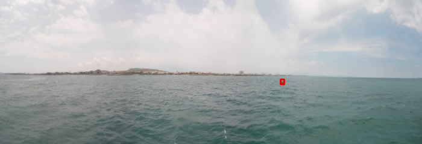
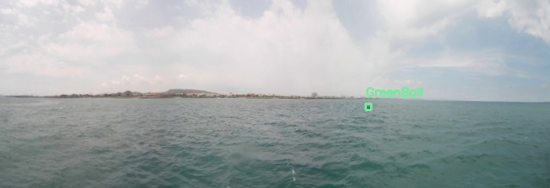
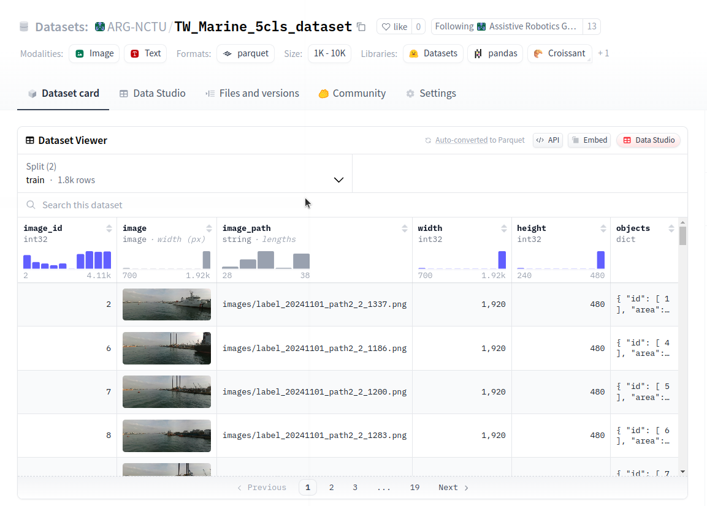

# Boats Dataset Processing

## Clone repo

```bash
cd ~/ && git clone git@github.com:ARG-NCTU/boats_dataset_processing.git
```

## Setting HuggingFace token

```bash
vim ~/.bashrc
```

Go to HuggingFace Web page: this [link](https://huggingface.co/settings/tokens) to add your own token

Then add this line (Replace with your token):
```bash
export HUGGINGFACE_TOKEN=hf_...xxxx
```

## Enter the repo

```bash
cd ~/boats_dataset_processing
```

## Enter Docker Environment

For first terminal to enter Docker environment:
```bash
source cpu_run.sh
```

For Second or more terminal to enter Docker environment:
```bash
source cpu_join.sh
```

## Data preparation

ROS Bag Example NAS [link](http://gofile.me/773h8/jDUcEglEw)

Make bags dir
```bash
mkdir -p ~/boats_dataset_processing/bags
```

Put these bags in bags folder. Notice that stitched images are not recorded in these bags.

## Usage

### Play ROS Bag and Save images (if stitched images NOT in bag)

#### Terminal 1: ROSCORE

```bash
cd ~/boats_dataset_processing
source cpu_run.sh
source environment.sh
roscore
```

#### Terminal 2: Play bag

```bash
cd ~/boats_dataset_processing
source cpu_join.sh
source environment.sh
source rosbag/play_bag_dir.sh $HOME/boats_dataset_processing/bags/0610_JS5 $HOME/boats_dataset_processing/config/topics-raw-camera.txt
```

#### Terminal 3: Stitching

First Setup
```bash
cd ~/ && git clone git@github.com:JetSeaAI/opencv-cuda-docker.git
cd ~/opencv-cuda-docker
source docker_build.sh
exit
```

Launch cylindrical stitching
```bash
cd ~/opencv-cuda-docker
source docker_run.sh
source environment.sh 127.0.0.1 127.0.0.1
roslaunch cylindrical_processing cylindrical_stitching_JS5.launch
```

#### Terminal 4: Save Images

```bash
cd ~/boats_dataset_processing
source cpu_join.sh
source environment.sh
roslaunch image_processing save_images.launch
```

Press "space" key to disable/enable saving images.

#### Terminal 5: Foxglove to visualize

```bash
cd ~/boats_dataset_processing
source cpu_join.sh
source environment.sh
rosrun foxglove_bridge foxglove_bridge
```

If you haven't installed the Foxglove app, download it from [Foxglove](https://foxglove.dev/download) (choose the "x86" version).

After launching the app:

* Go to **Layout** > **+ Add** > **Import Personal Layout**
* Select: `~/boats_dataset_processing/foxglove/camera1-2-3-pano-stitched.json`
* Then click **Open**

To open the ROS1 connection:

* Click the top-left Foxglove logo
* Select **Open Connection**
* Select **ROS 1**
* Then click **Open**


### Extract ROS Bag (if stitched images in bag)

```bash
cd ~/boats_dataset_processing/bags_processing
```

Stitched cameras, 1.0x acceleration rate, compressed images
```bash
python3 extract_bags.py \
--bag_dir bags \
--output_image_dir images \
--output_video_dir videos \
--accelerate_rate 1.0 \
--topic /camera_pano_stitched/color/image_raw/compressed \
--output_names _stitched \
--compressed
```

### Labelme

Use Labelme tools to label images


```bash
labelme
```

Visualize labelme annotations



```bash
cd ~/boats_dataset_processing/bags_processing
python3 visualize_bbox.py \
--root_dir ~/boats_dataset_processing/bags_processing/images
```

### Real Dataset processing

```bash
cd ~/boats_dataset_processing
```

Convert to COCO format
```bash
python3 labelme2coco.py \
--labelme_dir bags_processing/images \
--output_dir Ball_dataset \
--classes classes/Ball_classes.txt
```

Visualize COCO format annotations



```bash
python3 visualize_coco.py \
--coco_json Ball_dataset/annotations/instances_train2024.json \
--image_dir Ball_dataset/images \
--output_dir Ball_dataset/Visualization
```

Download existed COCO format dataset (if extending your dataset)

```bash
source download_coco.sh ARG-NCTU/TW_Marine_2cls_dataset_coco TW_Marine_2cls_dataset
```

Extend Dataset
```bash
python3 merge_coco.py \
--dataset1 TW_Marine_2cls_dataset \
--dataset2 Ball_dataset \
--output_dir TW_Marine_5cls_dataset
```

Convert to HuggingFace parquet format
```bash
python3 coco2parquet.py \
--input_dir TW_Marine_5cls_dataset/annotations \
--image_dir TW_Marine_5cls_dataset/images \
--output_dir TW_Marine_5cls_dataset_hf/annotations
```

Visualize parquet format annotations
```bash
python3 visualize_parquet.py \
--parquet_folder TW_Marine_5cls_dataset_hf/annotations
```

Add TW_Marine_5cls_dataset/annotations/classes.txt file and edit this file like:
```bash
Buoy
GuardBoat
RedBall
YellowBall
GreenBall
```

Copy train / val images
```bash
python3 copy_train_val_test_images.py --dir TW_Marine_5cls_dataset
```

Upload HuggingFace dataset



```bash
source upload_hf.sh ARG-NCTU/TW_Marine_5cls_dataset ARG-NCTU/TW_Marine_5cls_dataset_coco TW_Marine_5cls_dataset TW_Marine_5cls_dataset_hf
```