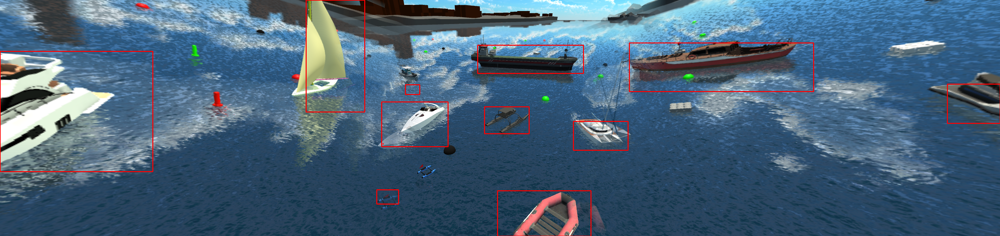

# Boats Dataset Processing
This repo is used for converting Robotx2022-Unity-dataset format to COCO format, and further to HugingFace dataset format.

## Clone repo

```bash
cd ~/ && git clone git@github.com:ARG-NCTU/boats_dataset_processing.git
```

## Setting HuggingFace token

```bash
vim ~/.bashrc
```

Go to HuggingFace Web page: this [link](https://huggingface.co/settings/tokens) to add your own token

Then add this line (Replace with your token):
```bash
export HUGGINGFACE_TOKEN=hf_...xxxx
```

## Enter the repo

```bash
cd ~/boats_dataset_processing
```

## Enter Docker Environment

For first terminal to enter Docker environment:
```bash
source cpu_run.sh
```

For Second or more terminal to enter Docker environment:
```bash
source cpu_join.sh
```

### 1. Robotx2022 Unity dataset Processing
Enter directory for unity dataset processing:
```bash
cd ~/boats_dataset_processing/Boat_dataset_unity
```

For prepare your data, follow this guide:
[docs/virtual-dataset-processing-stitching.md](https://github.com/ARG-NCTU/boats_dataset_processing/blob/main/docs/virtual-dataset-processing-stitching.md)

Or just download all stitched images and segmentations:
```bash
mkdir -p Images
cd Images
wget ftp://140.113.148.83/arg-projectfile-download/unity_dataset/unity_stitched_data/boats1-13.zip
unzip boats1-13.zip
rm boats1-13.zip
wget ftp://140.113.148.83/arg-projectfile-download/unity_dataset/unity_stitched_data/boats14-22.zip
unzip boats14-22.zip
rm boats14-22.zip
cd ..
```

#### 1.1. Robotx2022 Unity dataset Visualization
Print segmentation (You can modify the segementation image path)
```bash
python3 visualize_seg.py --seg_image_path ./Images/boats1-13/Scene1/1969_seg.png
```

Example result


#### 1.2. Gaussian Blur
Apply gaussian blur (You can modify the level of gaussian blur and images folders)
```bash
python3 gaussian_blur.py --datadir Images --blur_level 1
```

Example results
- Source Image


- Blur Level 1 Image


#### 1.3. Convert Robotx2022 Unity dataset format to COCO format
Convert to COCO format (You can first modify the mask_ids.json and classes.txt then modify obscure rate which is default to 30%)
```bash
python3 merge_json_unity.py \
--rgb_thermal rgb \
--boats_root_path Images \
--boat_count_per_scene 2002 \
--output Boats1-22/coco_formatted_unity_rgb_data.json
```
Labels should save in json files.

Example results
- Source Image with bbox annotations




Copy rgb & thermal images
```bash
python3 copy_images.py \
--boats_root_path Images \
--dest_rgb_folder Boats1-22/rgb_images \
--boat_count_per_scene 2002
```

### 2. Split COCO train/val/test annotations
Enter directory for unity dataset processing:
```bash
cd ~/boats_dataset_processing
```

(Merge real & converted virtual dataset, if add --real_dataset_dir arg) & Split COCO train/val/test annotations
```bash
python3 merge_real_virtual.py \
--unity_rgb_only \
--unity_dataset_dir Boat_dataset_unity/Boats1-22 \
--output_dir Boat_unity_dataset
```

Simple annotations for statistic analysis:
```bash
python3 statistic_class_simple.py \
--train_json Boat_unity_dataset/annotations/instances_train2024.json \
--val_json Boat_unity_dataset/annotations/instances_val2024.json \
--test_json Boat_unity_dataset/annotations/instances_test2024.json
```

Example output:
```bash
--------------------------------------------------
Total number of classes: 9
Total number of images: 39775
Training images: 27704 (69.65%)
Validation images: 7949 (19.98%)
Test images: 4122 (10.36%)
Total number of annotations: 429119
Training annotations: 300345 (69.99%)
Validation annotations: 85885 (20.01%)
Test annotations: 42889 (9.99%)
Average annotations per training image: 10.841214265088073
Average annotations per validation image: 10.804503711158636
Average annotations per test image: 10.404900533721495
--------------------------------------------------
Class Name            Train Annotations    Validation Annotations    Test Annotations
--------------------------------------------------
WAM_V                13362                3825                 1910                
Hovercraft           39041                11137                5564                
Yacht                102625               29218                14635               
CargoShip            13851                3936                 1980                
WorkBoat             13795                3914                 1972                
Blueboat             11341                3276                 1633                
MilitaryShip         69492                19994                9946                
CoastGuardShip       26741                7678                 3825                
Buoy                 10097                2907                 1424                
Class statistics saved to class_statistics.csv
```

Copy classes txt file:
```bash
cp Boat_dataset_unity/Boats1-22/classes.txt Boat_unity_dataset/annotations/
```

### 3. Convert COCO format to HuggingFace dataset format
Convert to HuggingFace dataset format:
```bash
python3 coco2jsonl.py \
--input_dir Boat_unity_dataset/annotations \
--image_dir Boat_unity_dataset/images \
--output_dir Boat_unity_dataset_hf/annotations
```


### 4. Upload HuggingFace dataset
```bash
source upload_hf.sh ARG-NCTU/Boat_unity_dataset ARG-NCTU/Boat_unity_dataset_coco Boat_unity_dataset Boat_unity_dataset_hf jsonl
```

Final HuggingFace Dataset Website:
- HuggingFace Format


- COCO Format


