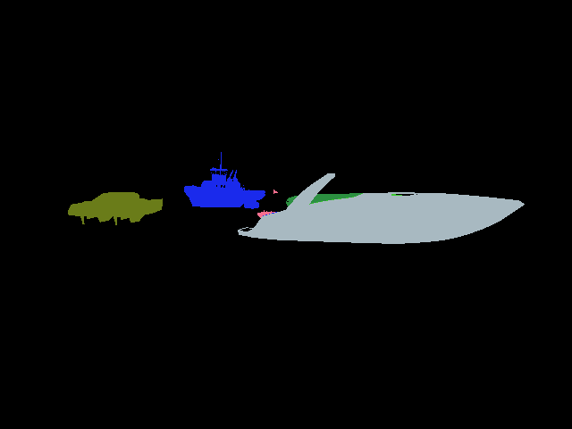
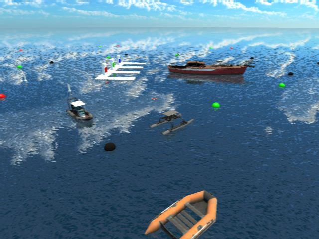

# Boats Dataset Processing
This repo is used for converting Robotx2022-Unity-dataset format to COCO format, and further to HugingFace dataset format.

## Clone repo

```bash
cd ~/ && git clone git@github.com:ARG-NCTU/boats_dataset_processing.git
```

## Setting HuggingFace token

```bash
vim ~/.bashrc
```

Go to HuggingFace Web page: this [link](https://huggingface.co/settings/tokens) to add your own token

Then add this line (Replace with your token):
```bash
export HUGGINGFACE_TOKEN=hf_...xxxx
```

## Enter the repo

```bash
cd ~/boats_dataset_processing
```

## Enter Docker Environment

For first terminal to enter Docker environment:
```bash
source cpu_run.sh
```

For Second or more terminal to enter Docker environment:
```bash
source cpu_join.sh
```

### 1. Robotx2022 Unity dataset Processing
Enter directory for unity dataset processing:
```bash
cd ~/boats_dataset_processing/Boat_dataset_unity
```

#### 1.1. Robotx2022 Unity dataset Visualization
Print segmentation (You can modify the segementation image path)
```bash
python3 visualize_seg.py
```

Example result



#### 1.2. Gaussian Blur
Apply gaussian blur (You can modify the level of gaussian blur and images folders)
```bash
python3 gaussian_blur.py
```

Example results
- Source Image


- Blur Level 1 Image



- Blur Level 2 Image


#### 1.3. Convert Robotx2022 Unity dataset format to COCO format
Convert to COCO format (You can first modify the mask_ids.json and classes.txt then modify obscure rate which is default to 30%)
```bash
python3 merge_json_unity.py
```
Labels should save in json files.

Visualization of multiboat 
- Blue: bbox
- Red: seg->bbox
- Pink: obscure bbox


Copy rgb & thermal images
```bash
python3 copy_images.py
```

### 2. Merge real & virtual dataset
- Download the real dataset: [link](http://gofile.me/773h8/7KZ0g4cRG)
- If Skipping step1, download converted virtual dataset: [link](http://gofile.me/773h8/uDx6b4Ufp)

Merge real & converted virtual dataset
```bash
python3 merge_real_virtual.py
```

Suffix of json file:
- rtvrr: RGB & Thermal Virtual + RGB Real
- rvrr: RGB Virtual + RGB Real
- rtv: RGB & Thermal Virtual
- rv : RGB Virtual
- tv: Thermal Virtual
- rr: RGB Real

Get stats of annotations
```bash
python3 statistic_class.py
```

Simple annotations (just train and validation two annotation files):
```bash
python3 statistic_class_simple.py
```

### 3. Convert COCO format to HuggingFace dataset format
Convert to HuggingFace dataset format:
```bash
python3 coco2jsonl.py
```

If you want to make Data Viewer available:
```bash
python3 coco2parquet.py
```

### 4. Upload HuggingFace dataset
Enter directory of huggingface dataset:
```bash
cd ~/boats_dataset_processing/Boat_dataset_hf
```

Some useful instructions for uploading hugginface dataset:
```bash
huggingface-cli login --token "$HUGGINGFACE_TOKEN"
huggingface-cli upload ARG-NCTU/Boat_dataset_2024 Boat_dataset_2024.py --repo-type=dataset --commit-message="Update script to hub"
huggingface-cli upload ARG-NCTU/Boat_dataset_2024 README.md --repo-type=dataset --commit-message="Update README to hub"
```

Upload annotations
```bash
python3 upload_hf_anno.py
```
Test annoatations
```bash
python3 test_hf_local.py
```

Upload images
```bash
cd ~/boats_dataset_processing/Boat_dataset
zip -r images.zip images/
huggingface-cli upload ARG-NCTU/Boat_dataset_2024 images.zip data/images.zip --repo-type=dataset --commit-message="Upload images to hub"
huggingface-cli upload ARG-NCTU/Boat_dataset_2024 ./annotations ./data --repo-type=dataset -commit-message="Upload training and val labels to hub"
```

Upload coco format dataset
```bash
cd ~/boats_dataset_processing/Boat_dataset
huggingface-cli upload ARG-NCTU/Boat_dataset_2024 annotations/classes.txt data/classes.txt --repo-type=dataset --commit-message="Upload classes list to hub"
huggingface-cli upload ARG-NCTU/Boat_dataset_coco_2024 annotations/classes.txt classes.txt --repo-type=dataset --commit-message="Upload classes list to hub"
huggingface-cli upload ARG-NCTU/Boat_dataset_coco_2024 ./annotations ./annotations --repo-type=dataset -commit-message="Upload training and val labels to hub"
zip -r train2024.zip train2024/
huggingface-cli upload ARG-NCTU/Boat_dataset_coco_2024 ./train2024.zip ./train2024.zip --repo-type=dataset --commit-message="Upload training images to hub"
zip -r val2024.zip val2024/
huggingface-cli upload ARG-NCTU/Boat_dataset_coco_2024 ./val2024.zip ./val2024.zip --repo-type=dataset --commit-message="Upload val images to hub"
```

Exit the Docker
```bash
exit
```

### 5. Download and use HuggingFace dataset

Clone or pull huggingface notebook repo
```bash
cd ~/
git clone git@github.com:ARG-NCTU/huggingface-notebooks.git
cd ~/huggingface-notebooks/
source gpu_run.sh
cd ~/huggingface-notebooks/transformers_doc/en/pytorch
```

Download HuggingFace dataset:
```bash
huggingface-cli login
huggingface-cli download ARG-NCTU/Boat_dataset_2024 data --repo-type dataset --local-dir ~/huggingface-notebooks/transformers_doc/en/pytorch
huggingface-cli download ARG-NCTU/Boat_dataset_2024 data/classes.txt --repo-type dataset --local-dir ~/huggingface-notebooks/transformers_doc/en/pytorch
huggingface-cli download ARG-NCTU/Boat_dataset_2024 data/images.zip --repo-type dataset --local-dir ~/huggingface-notebooks/transformers_doc/en/pytorch
```

Use Boat Dataset for object detection model training example:
```bash
cd ~/huggingface-notebooks/
source jupyter_notebook.sh 
```

Ctrl + click the website link. 
You can start edit jupyter notebook in transformers_doc/en/pytorch.

Another way is run python script:
```bash
cd ~/huggingface-notebooks/transformers_doc/en/pytorch
huggingface-cli login
python3 train_detr_boat.py
```

For Lifebuoy dataset, please refer to lifebuoy_huggingface_upload.md